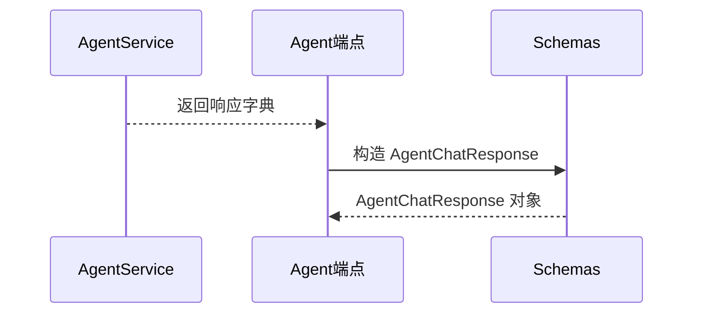

# AgentService 与 Schemas 的关系说明

## 🔍 问题：为什么在序列图中看到 AgentService 对 Schemas 的调用，但代码中没有直接导入？

**答案：** 序列图描述的是**数据流转关系**，而不是**直接代码调用**。`AgentService` 本身不直接使用 `schemas.py`，但它返回的数据会被用来构造 `schemas.py` 中的对象。

---

## 📊 实际代码调用链

### 1. AgentService 返回字典（不直接使用 Schemas）

```python
# V006/app/services/agent_service.py

def chat(self, query: str) -> Dict[str, Any]:
    # ... 处理逻辑 ...
    
    # 构建响应（返回普通字典）
    response = {
        "query": query,
        "intent": intent,
        "answer": answer,
        "reasoning": reasoning,
        "tool_calls": tool_calls,
        "raw_results": raw_results
    }
    
    return response  # ← 返回字典，不是 Schemas 对象
```

**关键点：**
- ✅ `agent_service.py` **不导入** `schemas.py`
- ✅ `agent_service.py` 返回的是**普通字典** `Dict[str, Any]`
- ✅ 字典的键名与 `AgentChatResponse` 的字段名**对应**

---

### 2. Agent 端点使用字典构造 Schemas 对象

```python
# V006/app/api/v1/endpoints/agent.py

from app.models.schemas import AgentChatRequest, AgentChatResponse  # ← 这里导入 Schemas
from app.services.agent_service import AgentService

@router.post("/chat", response_model=AgentChatResponse)
def agent_chat(request: AgentChatRequest):
    # 调用 AgentService（返回字典）
    response = agent.chat(request.query)  # ← 返回 Dict[str, Any]
    
    # 添加额外字段
    response["timestamp"] = datetime.now()
    response["trace_id"] = str(uuid.uuid4())
    
    # 使用字典构造 Schemas 对象
    return AgentChatResponse(**response)  # ← 这里构造 Schemas 对象
```

**关键点：**
- ✅ `agent.py` **导入** `schemas.py`
- ✅ `agent.py` 使用 `AgentService` 返回的字典构造 `AgentChatResponse` 对象
- ✅ `AgentChatResponse(**response)` 是 Pydantic 的字典解包语法

---

## 🔄 完整数据流转路径

```
┌─────────────────────────────────────────────────────────┐
│ AgentService (agent_service.py)                         │
│                                                          │
│ def chat(query: str) -> Dict[str, Any]:                 │
│     response = {                                        │
│         "query": query,                                 │
│         "intent": intent,                                │
│         "answer": answer,                                │
│         "reasoning": reasoning,                          │
│         "tool_calls": tool_calls,                        │
│         "raw_results": raw_results                       │
│     }                                                    │
│     return response  # ← 返回字典                        │
└─────────────────────────────────────────────────────────┘
                    ↓
┌─────────────────────────────────────────────────────────┐
│ Agent 端点 (agent.py)                                    │
│                                                          │
│ from app.models.schemas import AgentChatResponse        │
│                                                          │
│ response = agent.chat(request.query)  # ← 接收字典      │
│ response["timestamp"] = datetime.now()                  │
│ response["trace_id"] = str(uuid.uuid4())                │
│                                                          │
│ return AgentChatResponse(**response)  # ← 构造 Schemas   │
└─────────────────────────────────────────────────────────┘
                    ↓
┌─────────────────────────────────────────────────────────┐
│ Schemas (schemas.py)                                     │
│                                                          │
│ class AgentChatResponse(BaseResponse):                   │
│     query: str                                           │
│     intent: str                                          │
│     answer: str                                          │
│     reasoning: str                                       │
│     tool_calls: List[Dict[str, Any]]                     │
│     raw_results: Dict[str, Any]                          │
│     timestamp: datetime                                  │
│                                                          │
│ # AgentChatResponse(**response) 创建对象并验证          │
└─────────────────────────────────────────────────────────┘
                    ↓
┌─────────────────────────────────────────────────────────┐
│ FastAPI 自动序列化                                       │
│                                                          │
│ AgentChatResponse 对象 → JSON 响应                      │
└─────────────────────────────────────────────────────────┘
```

---

## 📋 序列图中的表示

序列图使用以下方式表示这个间接关系：



**解读：**
- `AgentSvc-->>AgentEP`: `AgentService.chat()` 返回字典给 `agent.py`
- `AgentEP->>Schemas`: `agent.py` 使用字典构造 `AgentChatResponse`（来自 `schemas.py`）
- `Schemas-->>AgentEP`: `AgentChatResponse` 对象返回给 `agent.py`

---

## 🎯 为什么这样设计？

### 1. **关注点分离**

- **AgentService**: 专注于业务逻辑，不关心 API 格式
- **Agent 端点**: 负责 API 层的数据转换和验证
- **Schemas**: 定义 API 的输入输出格式

### 2. **灵活性**

- `AgentService` 可以返回任意格式的字典
- `Agent 端点` 可以根据需要添加字段（如 `timestamp`, `trace_id`）
- `Schemas` 确保最终输出的格式符合 API 规范

### 3. **可测试性**

- `AgentService` 可以独立测试，不需要依赖 `schemas.py`
- `Schemas` 可以独立测试数据验证逻辑

---

## 💡 代码示例对比

### ❌ 如果 AgentService 直接返回 Schemas 对象

```python
# 不好的设计
from app.models.schemas import AgentChatResponse

class AgentService:
    def chat(self, query: str) -> AgentChatResponse:  # ← 直接返回 Schemas
        # ...
        return AgentChatResponse(**response)  # ← 在 Service 层构造 Schemas
```

**问题：**
- Service 层依赖 API 层的 Schemas
- 无法灵活添加 API 层特有的字段（如 `trace_id`）
- Service 层和 API 层耦合

---

### ✅ 当前设计（推荐）

```python
# Service 层：返回字典
class AgentService:
    def chat(self, query: str) -> Dict[str, Any]:  # ← 返回字典
        # ...
        return response  # ← 普通字典

# API 层：构造 Schemas 对象
@router.post("/chat", response_model=AgentChatResponse)
def agent_chat(request: AgentChatRequest):
    response = agent.chat(request.query)  # ← 接收字典
    response["trace_id"] = str(uuid.uuid4())  # ← 添加 API 层字段
    return AgentChatResponse(**response)  # ← 构造 Schemas
```

**优点：**
- Service 层不依赖 API 层
- API 层可以灵活添加字段
- 清晰的职责分离

---

## 🔍 查找间接关系的技巧

### 1. **查看返回值的使用**

```python
# agent.py 中
response = agent.chat(request.query)  # ← 接收 AgentService 的返回值
return AgentChatResponse(**response)   # ← 用返回值构造 Schemas
```

### 2. **查看字段对应关系**

```python
# agent_service.py 返回的字典
response = {
    "query": query,        # ← 对应
    "intent": intent,      # ← 对应
    "answer": answer,      # ← 对应
    "reasoning": reasoning, # ← 对应
    "tool_calls": tool_calls,
    "raw_results": raw_results
}

# schemas.py 中的定义
class AgentChatResponse(BaseResponse):
    query: str              # ← 对应
    intent: str             # ← 对应
    answer: str             # ← 对应
    reasoning: str          # ← 对应
    tool_calls: List[Dict[str, Any]]
    raw_results: Dict[str, Any]
    timestamp: datetime     # ← 在 agent.py 中添加
```

### 3. **查看导入语句**

```python
# agent_service.py - 不导入 schemas
from typing import Dict, Any
from app.services.tools import GrainTools
# ❌ 没有 from app.models.schemas import ...

# agent.py - 导入 schemas
from app.models.schemas import AgentChatRequest, AgentChatResponse  # ✅
```

---

## 📚 总结

1. **序列图描述的是数据流转**，不是直接代码调用
2. **AgentService 不直接使用 Schemas**，它返回字典
3. **Agent 端点使用字典构造 Schemas 对象**
4. **这种设计实现了关注点分离**，Service 层不依赖 API 层

**关键代码位置：**
- `agent_service.py:79-95` - 返回字典
- `agent.py:57-65` - 使用字典构造 Schemas 对象
- `schemas.py:84-92` - `AgentChatResponse` 定义

