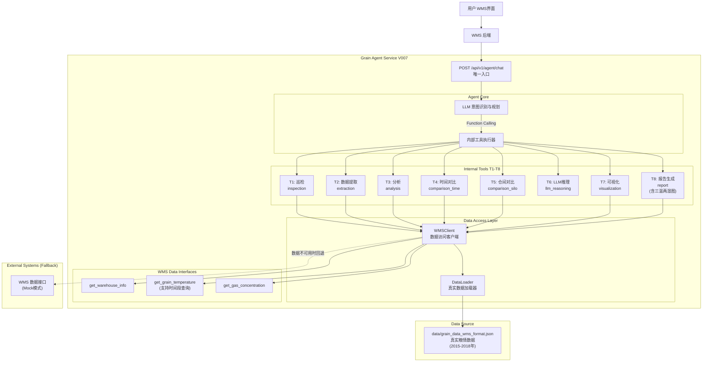

# V007 系统迭代设计文档

> 说明：本文件为 V007 历史文档，V008 仅保留参考，不作为当前版本实现依据。

## 1. 引言

### 1.1 背景
基于《粮情分析智能体需求规格说明书》，V007 版本在 V006 的基础上实现了**真实数据访问**和**三温两湿图生成**功能。V006 版本实现了**纯自然语言交互的智能体 (Agent-Only Architecture)**，移除了所有用于直接调用的业务微服务接口（如 `/inspect`、`/analyze`），强制所有交互通过 Agent 进行。

### 1.2 核心目标与系统边界
构建一个独立的**智能体后端服务**，**不包含**任何 WMS 业务逻辑或前端界面开发。

*   **服务定位 (Inbound)**: 作为下游服务，仅通过 `/api/v1/agent/chat` 接口被动接收自然语言请求。
*   **数据来源 (Outbound)**: 从真实数据文件（`data/grain_data_wms_format.json`）获取业务数据，支持时间段查询和历史数据分析。
*   **交付范围**: 仅包含智能体 API 服务（Python/FastAPI）。

### 1.3 V007 核心改进

**相比 V006 的主要变化**：
- ✅ **真实数据访问**：使用 `DataLoader` 从 JSON 文件加载真实粮情数据（2015-2018年历史数据）
- ✅ **三温图生成**：新增 `generate_three_temp_chart()` 方法，生成气温、仓温、粮温三条曲线图
- ✅ **两湿图生成**：新增 `generate_two_humidity_chart()` 方法，生成气湿、仓湿两条曲线图
- ✅ **时间段数据查询**：支持用户指定时间段（如"2015年4月"）进行数据查询和图表生成
- ✅ **报告增强**：Word 报告包含完整的三温两湿图，按顺序嵌入

---

## 2. 架构设计

### 2.1 架构核心理念
V007 继承 V006 的 **Agent-Only** 架构，并增强数据访问能力。

*   **交互模式**: WMS 用户界面 -> WMS 后端 -> **智能体对话 API** -> LLM 意图识别 -> **内部工具调用 (GrainTools)** -> **从真实数据文件获取数据** -> 生成回答。
*   **控制权**: **LLM 是唯一的业务逻辑入口**。外部系统不能跨过 LLM 直接调用 T1 巡检或 T3 分析功能。
*   **数据流**: 双向交互。
    1.  WMS -> Agent (发送自然语言问题)
    2.  Agent -> Tool Execution (内部调度)
    3.  Tool -> DataLoader (从真实数据文件获取业务数据)
    4.  Agent -> WMS (返回答案)

### 2.2 V007 逻辑架构



---

## 3. 接口设计 (API Specification)

### 3.1 核心交互接口 (Agent Interface)

这是实现"用户对话 -> 意图识别 -> 工具调用"的**唯一入口**。

#### A1: 智能对话 (Chat)
*   **Endpoint**: `POST /api/v1/agent/chat`
*   **功能**: 接收自然语言问题，执行完整的 Agent 循环（思考-调用-回答）。
*   **输入**: 
    ```json
    {
      "query": "帮我看看1号仓现在的粮温，有没有异常？"
    }
    ```
*   **输出**: 
    ```json
    {
      "query": "帮我看看1号仓现在的粮温，有没有异常？",
      "intent": "analysis",
      "answer": "1号仓当前平均粮温 25.1℃，处于正常范围...",
      "reasoning": "用户询问粮温及异常，需先获取数据再进行分析...",
      "tool_calls": [
        {
          "tool": "get_grain_temperature",
          "params": {"house_code": "1", "start_time": "...", "end_time": "..."}
        },
        {
          "tool": "analysis",
          "params": {"silo_id": "1"}
        }
      ],
      "raw_results": {
        "get_grain_temperature": {...},
        "analysis": {...}
      },
      "timestamp": "2025-12-15T10:00:00",
      "trace_id": "uuid-here"
    }
    ```

### 3.2 内部能力 (Internal Capabilities - T1-T8)

**注意**: 以下功能仅作为 `GrainTools` 类的方法存在于 `app/services/tools.py` 中，**不再通过 HTTP 接口暴露**。它们通过 LLM Function Calling 机制被 Agent 自动调用。

#### T1: 全库巡检 (inspection)
*   **功能**: 检查指定粮库的所有仓，识别异常点位（如温度过高）
*   **参数**: `warehouse_ids: Optional[List[str]]` - 粮库ID列表，留空则检查所有
*   **返回**: 异常点位列表、统计摘要

#### T2: 数据提取 (extraction)
*   **功能**: 从 WMS 接口获取指定仓在一段时间内的粮温/气体等原始数据与统计摘要
*   **参数**: `silo_id: str`, `time_range_hours: int = 24`
*   **返回**: 原始数据列表、统计摘要（平均、最高、最低）

#### T3: 智能分析 (analysis)
*   **功能**: 对指定仓号进行深入的粮情分析，识别风险（如热点、霉变风险）并给出评分
*   **参数**: `silo_id: str`, `readings: Optional[List] = None`
*   **返回**: 风险等级、评分、发现列表、建议

#### T4: 时间对比 (comparison_time)
*   **功能**: 对比同一仓在不同时间段的粮温变化
*   **参数**: `silo_id: str`, `time_windows: List[Dict[str, int]]`
*   **返回**: 对比结果、变化趋势

#### T5: 仓间对比 (comparison_silo)
*   **功能**: 对比多个仓在同一时间段的粮温差异
*   **参数**: `silo_ids: List[str]`, `time_range_hours: int = 24`
*   **返回**: 对比结果、差异分析

#### T6: LLM 融合推理 (llm_reasoning)
*   **功能**: 基于上下文数据进行 LLM 推理，生成完整的分析文字和建议
*   **参数**: `query: str`, `context: Dict[str, Any]`
*   **返回**: 推理结果、建议列表、分析依据

#### T7: 可视化 (visualization)
*   **功能**: 生成粮温可视化图表（折线图、热力图、3D图）
*   **参数**: `silo_id: str`, `chart_type: str = "line"`, `time_range_hours: Optional[int] = None`, `start_time: Optional[datetime] = None`, `end_time: Optional[datetime] = None`
*   **返回**: 图表文件路径、状态
*   **V007增强**: 支持时间段查询，X轴使用实际数据采集日期

#### T8: 报告生成 (report)
*   **功能**: 生成粮情分析报告（Word 文档），包含图表和完整分析文字
*   **参数**: `silo_ids: List[str]`, `report_type: str = "daily"`, `start_time: Optional[str] = None`, `end_time: Optional[str] = None`
*   **返回**: 报告文件路径、报告ID
*   **V007增强**: 
  - 新增三温图生成（`generate_three_temp_chart()`）
  - 新增两湿图生成（`generate_two_humidity_chart()`）
  - 支持时间段查询，报告内容按指定时间段生成

### 3.3 WMS 标准数据接口

以下接口作为工具暴露给 LLM，用于获取 WMS 业务数据：

#### get_warehouse_info
*   **功能**: 查询仓房基本信息
*   **参数**: `house_code: str`
*   **返回**: 仓房信息（仓号、库点、仓型等）

#### get_grain_temperature
*   **功能**: 查询粮温数据
*   **参数**: `house_code: str`, `start_time: datetime`, `end_time: datetime`
*   **返回**: 粮温数据列表（包含时间、平均/最高/最低温度、原始数据）
*   **V007增强**: 
  - 优先从真实数据文件（`data/grain_data_wms_format.json`）查询
  - 支持时间段过滤（`start_time` 和 `end_time`）
  - 如果真实数据不可用或无匹配数据，回退到 Mock 模式

#### get_gas_concentration
*   **功能**: 查询气体浓度数据
*   **参数**: `house_code: str`, `start_time: datetime`, `end_time: datetime`
*   **返回**: 气体浓度数据列表（CO2、O2等）

---

## 4. 数据模型设计

基于需求文档第 8 节，在 `app/models/domain.py` 中定义了以下核心模型：

```python
class Reading(BaseModel):
    sensor_id: str
    timestamp: datetime
    value: float
    type: str  # temperature, humidity

class GrainTempData(BaseModel):
    check_time: datetime
    avg_temp: float
    max_temp: float
    min_temp: float
    temp_values: str  # 原始数据字符串

class GasConcentrationData(BaseModel):
    check_time: datetime
    co2: Optional[float]
    o2: Optional[float]

class WarehouseInfo(BaseModel):
    house_code: str
    house_name: str
    depot_name: str
    grain_type: Optional[str]
    capacity: Optional[float]

class AnalysisResult(BaseModel):
    silo_id: str
    score: float
    risk_level: str  # low, medium, high
    findings: List[str]
    recommendations: List[str]
```

---

## 5. 实施总结

### V006 阶段（已完成）✅
1.  **基础重构**: 基于 `V003` 创建 `V006` 代码库，实现 Agent-Only 架构 ✅
2.  **核心服务实现**: T1-T8 工具集、WMS Client、工具定义 ✅
3.  **新功能开发**: T7 可视化、T8 报告生成、T6 推理 ✅
4.  **集成与测试**: 功能测试、端到端测试、超时保护 ✅

### V007 阶段（新增）✅

#### 阶段 1: 真实数据访问实现 ✅
1.  **DataLoader 模块**: 实现数据加载、索引建立、时间段查询 ✅
2.  **WMS Client 重构**: 优先使用真实数据，支持时间段过滤，优雅降级到 Mock ✅
3.  **数据文件**: 使用 `data/grain_data_wms_format.json`（2015-2018年历史数据） ✅

#### 阶段 2: 三温两湿图生成 ✅
1.  **三温图生成**: `generate_three_temp_chart()` 方法，生成气温、仓温、粮温三条曲线 ✅
2.  **两湿图生成**: `generate_two_humidity_chart()` 方法，生成气湿、仓湿两条曲线 ✅
3.  **图表规范**: 符合科学图表规范，使用不同颜色、图例、网格线 ✅

#### 阶段 3: 报告生成增强 ✅
1.  **报告内容增强**: Word 报告包含三温图和两湿图，按顺序嵌入 ✅
2.  **时间段支持**: 支持用户指定时间段（如"2015年4月"）进行数据查询和图表生成 ✅
3.  **X轴日期**: 图表X轴使用实际数据采集日期，而非当前日期 ✅

#### 阶段 4: 测试与验证 ✅
1.  **数据访问测试**: `test_v007_data.py` 验证真实数据加载和查询 ✅
2.  **图表生成测试**: 验证三温图和两湿图生成 ✅
3.  **时间段查询测试**: 验证时间段数据查询和图表绘制 ✅

---

## 6. 配置说明

### 环境变量

| 变量名 | 说明 | 默认值 | 必需 |
|:---|:---|:---|:---|
| `DASHSCOPE_API_KEY` | 通义千问 API Key | - | ✅ |
| `LLM_MODEL` | LLM 模型名称 | `qwen-max` | ❌ |
| `LLM_BASE_URL` | LLM API 基础URL | `https://dashscope.aliyuncs.com/compatible-mode/v1` | ❌ |
| `DEBUG` | 调试模式 | `false` | ❌ |
| `EXPOSE_DOCS` | 暴露 API 文档 | `false` | ❌ |

### 配置行为

*   **DEBUG=false, EXPOSE_DOCS=false**: 
    *   仅暴露 `/api/v1/agent/chat` 接口
    *   不暴露 `/docs`、`/redoc`、`/openapi.json`
    *   根路径 `/` 始终可用（健康检查）

*   **DEBUG=true 或 EXPOSE_DOCS=true**:
    *   暴露 API 文档（`/docs`）
    *   其他行为不变

---

## 7. 技术特性

### LLM Function Calling
*   **多轮调用**: 最多支持 3 轮工具调用，支持"获取数据→分析→可视化/报告"等链路
*   **超时保护**: LLM API 调用设置 30 秒超时
*   **错误处理**: LLM API 调用失败时回退到 Mock 模式

### 工具调用链示例

**报告生成流程**:
```
用户: "生成1号仓的日报"
  → LLM 识别意图: report
  → 调用 report(silo_ids=["1"], report_type="daily")
    → 调用 get_warehouse_info("1")
    → 调用 get_grain_temperature("1", ...)
    → 调用 visualization("1", chart_type="line")
    → 调用 analysis("1")
    → 调用 llm_reasoning(query="...", context={...})
    → 生成 Word 文档（包含图表和分析文字）
  → 返回报告文件路径
```

**巡检流程**:
```
用户: "巡检一下所有粮仓"
  → LLM 识别意图: inspection
  → 调用 inspection(warehouse_ids=[])
    → 遍历所有仓
    → 调用 get_grain_temperature(...)
    → 识别异常点位
  → 返回异常列表和统计
```

---

## 8. 文件结构

```
V007/
├── app/
│   ├── main.py                    # FastAPI 应用入口
│   ├── api/
│   │   └── v1/
│   │       ├── api.py            # 路由聚合
│   │       └── endpoints/
│   │           └── agent.py      # 唯一对外接口
│   ├── core/
│   │   └── config.py             # 配置管理
│   ├── models/
│   │   ├── domain.py             # 领域模型
│   │   └── schemas.py            # API Schema
│   └── services/
│       ├── agent_service.py      # Agent 核心服务
│       ├── llm_service.py        # LLM 服务
│       ├── analysis_service.py   # 分析服务
│       ├── tools.py              # T1-T8 工具实现（含三温两湿图）
│       ├── tool_definitions.py   # 工具 JSON Schema
│       ├── wms_client.py         # WMS 客户端（使用真实数据）
│       └── data_loader.py        # 数据加载模块（V007新增）
├── artifacts/
│   ├── charts/                   # 生成的图表
│   └── reports/                  # 生成的报告
├── requirements.txt              # Python 依赖
├── test_agent.py                 # Agent 测试脚本
├── test_requests.py              # HTTP 请求测试脚本
├── test_v007_data.py            # V007 数据访问测试脚本（新增）
├── README.md                     # 项目说明
├── V007_实现总结.md              # V007 实现总结（新增）
├── 运行指南.md                   # 运行指南
└── interface_schema.md           # WMS 接口规范
```

---

## 9. 待确认事项

1.  **WMS 真实地址**: 目前使用 Mock 数据，需确认何时接入真实环境
2.  **可视化样式**: 图表的具体配色与样式标准
3.  **报告模板**: Word 报告的具体格式要求（当前为基本格式）
4.  **超时时间**: 30秒 LLM 超时是否足够（复杂查询可能需要更长时间）

---

## 10. 版本状态

**版本**: V007  
**状态**: ✅ 功能完成  
**日期**: 2026-01-04

### V006 已完成功能（继承）
- ✅ Agent-Only 架构（单一接口）
- ✅ T1-T8 完整工具集
- ✅ WMS 标准接口对齐
- ✅ 报告生成（含图表和分析文字）
- ✅ 超时保护和错误处理

### V007 新增功能
- ✅ 真实数据访问（DataLoader 模块）
- ✅ 三温图生成（气温、仓温、粮温）
- ✅ 两湿图生成（气湿、仓湿）
- ✅ 时间段数据查询和图表生成
- ✅ 报告增强（包含三温两湿图）

### 已知限制
- LLM API 超时：30秒，对于复杂查询可能不够
- 多轮调用限制：最多 3 轮，可能限制复杂任务
- 报告格式：目前为基本格式，可扩展
- 真实数据：目前为历史数据（2015-2018年），查询当前时间范围会回退到 Mock 模式
- 数据点限制：三温图和两湿图最多显示7个数据点（为显示清晰，非用户需求）