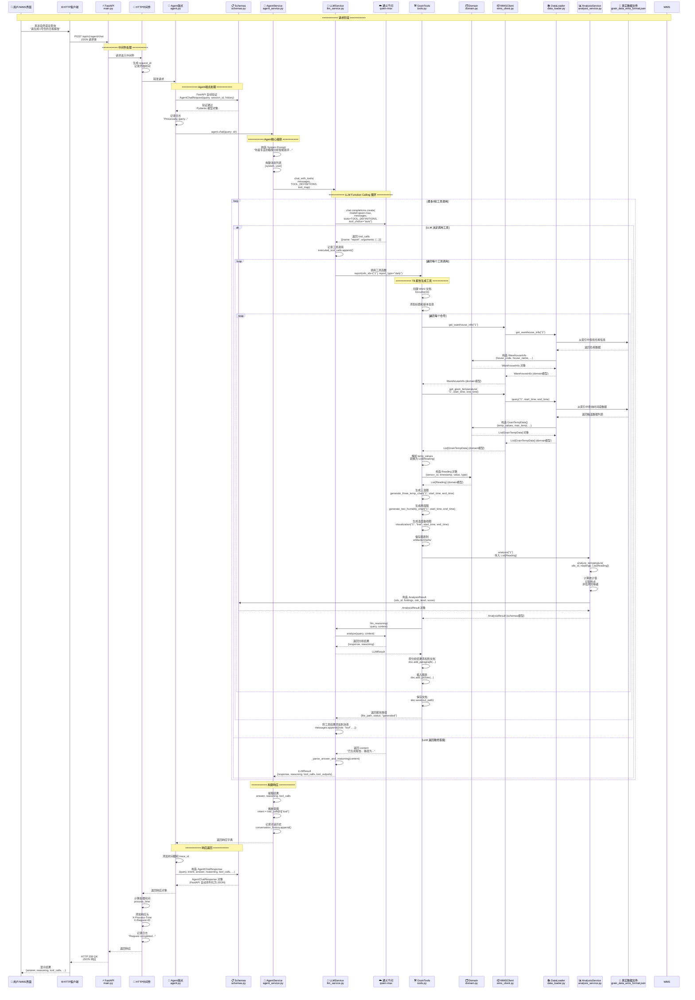
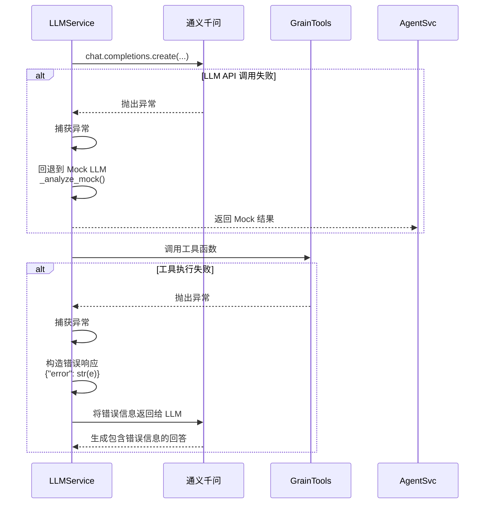

# V007 系统完整流程序列图

> 说明：本文件为 V007 历史文档，V008 仅保留参考，不作为当前版本实现依据。

## 📊 带泳道的序列图（完整流程）

本文档展示了 V007 系统从用户请求到响应的完整交互流程，包括所有关键组件的交互细节。V007 在 V006 的基础上增加了真实数据访问和三温两湿图生成功能。

### 场景：用户请求生成粮情分析报告



---

## 📦 Model 层在流程中的位置和作用

### Domain 模型 (`domain.py`) - 业务数据核心结构

**位置：** 在数据获取和内部处理阶段

**作用：**
1. **WMSClient → Tools**: WMSClient 从 WMS API 获取 JSON 数据后，构造 Domain 模型
   - `WarehouseInfo`: 仓房基本信息（house_code, house_name, capacity 等）
   - `GrainTempData`: 粮温数据（temp_values, max_temp, min_temp 等）
   - `GasConcentrationData`: 气体浓度数据

2. **Tools → AnalysisService**: Tools 将 Domain 数据转换为内部处理格式
   - `Reading`: 传感器读数（sensor_id, timestamp, value, type）
   - 用于温度分析、热点识别等

**特点：**
- ✅ 描述业务概念（粮仓、传感器、温度数据）
- ✅ 用于内部业务逻辑处理
- ✅ 与 WMS 接口数据结构对应
- ✅ 相对稳定，不随 API 变化

**在序列图中的位置：**
```
WMS (JSON) → WMSClient → Domain (构造 WarehouseInfo/GrainTempData) → Tools
Tools → Domain (构造 Reading) → AnalysisService
```

---

### Schemas 模型 (`schemas.py`) - API 请求/响应格式

**位置：** 在 API 边界和 Service 层返回结果时

**作用：**
1. **API 请求验证** (`AgentChatRequest`):
   - FastAPI 自动验证 HTTP 请求体
   - 确保 `query`, `session_id`, `history` 字段格式正确
   - 位置：AgentEP 接收请求时

2. **API 响应序列化** (`AgentChatResponse`):
   - FastAPI 自动将 Python 对象序列化为 JSON
   - 包含 `query`, `intent`, `answer`, `reasoning`, `tool_calls` 等字段
   - 位置：AgentEP 返回响应时

3. **Service 层返回结构** (`AnalysisResult`):
   - AnalysisService 返回标准化的分析结果
   - 包含 `silo_id`, `findings`, `risk_level`, `score` 等字段
   - 位置：AnalysisService → Tools

**特点：**
- ✅ 描述 API 接口的输入输出
- ✅ 用于 HTTP 请求/响应的序列化和验证
- ✅ 可能组合多个 Domain 模型
- ✅ 可能包含 API 特有的字段（如 `trace_id`）

**在序列图中的位置：**
```
HTTP (JSON) → AgentEP → Schemas (AgentChatRequest 验证) → AgentService
AnalysisService → Schemas (AnalysisResult) → Tools
AgentService → AgentEP → Schemas (AgentChatResponse 序列化) → HTTP (JSON)
```

---

### 模型流转完整路径

```
┌─────────────────────────────────────────────────────────────┐
│ API 层 (HTTP 边界)                                          │
│  ┌──────────────────────────────────────────────────────┐  │
│  │ Schemas: AgentChatRequest                            │  │ ← 请求验证
│  └──────────────────────────────────────────────────────┘  │
└─────────────────────────────────────────────────────────────┘
                    ↓
┌─────────────────────────────────────────────────────────────┐
│ Service 层 (业务逻辑)                                        │
│  ┌──────────────────────────────────────────────────────┐  │
│  │ AgentService → LLMService → GrainTools              │  │
│  └──────────────────────────────────────────────────────┘  │
└─────────────────────────────────────────────────────────────┘
                    ↓
┌─────────────────────────────────────────────────────────────┐
│ Integration 层 (外部数据)                                    │
│  ┌──────────────────────────────────────────────────────┐  │
│  │ WMSClient → Domain (WarehouseInfo, GrainTempData)    │  │ ← Domain 模型
│  └──────────────────────────────────────────────────────┘  │
└─────────────────────────────────────────────────────────────┘
                    ↓
┌─────────────────────────────────────────────────────────────┐
│ Tools 层 (数据处理)                                          │
│  ┌──────────────────────────────────────────────────────┐  │
│  │ Tools → Domain (Reading) → AnalysisService           │  │ ← Domain 模型
│  └──────────────────────────────────────────────────────┘  │
└─────────────────────────────────────────────────────────────┘
                    ↓
┌─────────────────────────────────────────────────────────────┐
│ Analysis 层 (分析结果)                                       │
│  ┌──────────────────────────────────────────────────────┐  │
│  │ AnalysisService → Schemas (AnalysisResult)          │  │ ← Schemas 模型
│  └──────────────────────────────────────────────────────┘  │
└─────────────────────────────────────────────────────────────┘
                    ↓
┌─────────────────────────────────────────────────────────────┐
│ API 层 (HTTP 边界)                                          │
│  ┌──────────────────────────────────────────────────────┐  │
│  │ Schemas: AgentChatResponse                           │  │ ← 响应序列化
│  └──────────────────────────────────────────────────────┘  │
└─────────────────────────────────────────────────────────────┘
```

---

## 🔍 关键流程说明

### 1. 请求入口流程

```
用户 → HTTP客户端 → FastAPI → HTTP中间件 → Agent端点 → Schemas验证
```

- **FastAPI** (`main.py`): 应用入口，配置 CORS 和中间件
- **HTTP中间件**: 记录请求ID、处理时间，添加响应头
- **Agent端点** (`agent.py`): 唯一对外接口 `/api/v1/agent/chat`
- **Schemas** (`schemas.py`): FastAPI 自动验证请求（`AgentChatRequest`），序列化响应（`AgentChatResponse`）

### 2. Agent 核心编排流程

```
Agent端点 → AgentService → LLMService (Function Calling)
```

- **AgentService** (`agent_service.py`):
  - 构造 System Prompt
  - 构建消息列表
  - 调用 LLMService 进行 Function Calling
  - 提取结果并构建响应

### 3. LLM Function Calling 循环

```
LLMService → 通义千问 → 工具调用 → 工具执行 → 结果返回 → LLM生成答案
```

- **LLMService** (`llm_service.py`):
  - 支持最多3轮工具调用
  - 每轮：LLM 决定调用工具 → 执行工具 → 将结果返回给 LLM
  - 最终：LLM 生成包含工具结果的完整答案

### 4. 工具执行流程（以 T8 报告生成为例）

```
GrainTools.report() → WMSClient → WMS API
                   → AnalysisService
                   → LLMService (推理)
                   → 生成文档和图表
```

- **GrainTools** (`tools.py`): T1-T8 工具实现
- **WMSClient** (`wms_client.py`): 调用 WMS 标准数据接口
- **AnalysisService** (`analysis_service.py`): 粮情数据分析
- **LLMService**: 生成推理和建议

### 5. 数据流向

```
WMS数据接口 (JSON)
    ↓
WMSClient → Domain (构造 WarehouseInfo, GrainTempData)
    ↓
GrainTools → Domain (构造 Reading) → AnalysisService
    ↓
AnalysisService → Schemas (构造 AnalysisResult)
    ↓
LLMService → AgentService → Schemas (构造 AgentChatResponse)
    ↓
用户 (JSON)
```

**关键模型流转：**
- **Domain 模型** (`domain.py`): 业务数据核心结构，在 WMSClient → Tools → AnalysisService 之间传递
  - `WarehouseInfo`: 仓房基本信息
  - `GrainTempData`: 粮温数据
  - `Reading`: 传感器读数（内部处理）
- **Schemas 模型** (`schemas.py`): API 请求/响应格式，在 API 层和 Service 层之间传递
  - `AgentChatRequest`: 请求验证
  - `AgentChatResponse`: 响应序列化
  - `AnalysisResult`: 分析结果结构

---

## 📋 关键组件职责

| 组件 | 职责 | 关键方法/模型 |
|------|------|----------|
| **FastAPI** | Web框架，路由和中间件 | `app.main:app` |
| **Agent端点** | 接收HTTP请求，调用Agent服务 | `agent_chat()` |
| **Schemas** | API请求/响应验证和序列化 | `AgentChatRequest`, `AgentChatResponse`, `AnalysisResult` |
| **AgentService** | Agent核心编排，管理对话历史 | `chat()` |
| **LLMService** | LLM调用，Function Calling实现 | `chat_with_tools()` |
| **GrainTools** | T1-T8工具实现，业务逻辑封装 | `report()`, `analysis()`, `inspection()` 等 |
| **Domain** | 业务数据核心结构 | `WarehouseInfo`, `GrainTempData`, `Reading` |
| **WMSClient** | WMS数据接口客户端，构造Domain模型 | `get_warehouse_info()`, `get_grain_temperature()` 等 |
| **AnalysisService** | 粮情数据分析算法，返回Schemas模型 | `analyze_temperature()` |

---

## 🔄 多轮工具调用示例

以下场景展示了 LLM 如何进行多轮工具调用：

### 场景：用户查询 "1号仓的粮温情况如何？请给出储藏建议。"

**第1轮：**
- LLM 决定调用 `extraction` 获取数据
- 执行 `extraction("1", 24)`
- 返回粮温数据给 LLM

**第2轮：**
- LLM 基于数据调用 `analysis` 进行分析
- 执行 `analysis("1")`
- 返回分析结果给 LLM

**第3轮：**
- LLM 调用 `llm_reasoning` 生成建议
- 执行 `llm_reasoning(query, context)`
- 返回推理结果给 LLM

**最终：**
- LLM 综合所有工具结果，生成完整答案
- 返回给用户

---

## ⚠️ 错误处理流程



---

## 📊 性能指标

- **LLM API 超时**: 30秒
- **HTTP 请求超时**: 60秒
- **最大工具调用轮数**: 3轮
- **并发支持**: FastAPI 异步处理

---

## 🎯 设计亮点

1. **Agent-Only 架构**: 单一入口，所有功能通过 LLM Function Calling 调用
2. **多轮工具调用**: 支持复杂的工具链调用（如：获取数据 → 分析 → 生成报告）
3. **错误容错**: LLM 失败时回退到 Mock，工具失败时返回错误信息给 LLM
4. **清晰分层**: API → Service → Tools → Integration
5. **完整工具集**: T1-T8 全部实现，支持 WMS 标准接口
6. **模型层分离**: Domain 模型（业务数据）和 Schemas 模型（API格式）职责清晰，Domain 在内部流转，Schemas 在 API 边界使用

