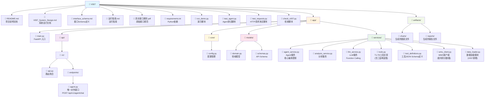
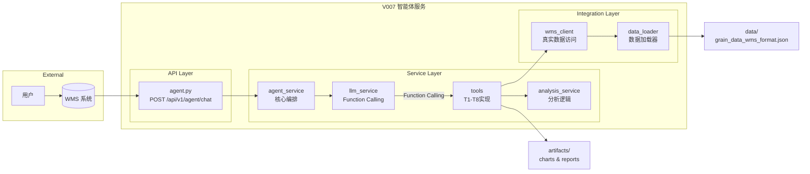

# V007 目录文档结构分析

> 说明：本文件为 V007 历史文档，V008 仅保留参考，不作为当前版本实现依据。

## 📁 目录结构图



---

## 📋 文件清单

| 文件/目录 | 说明 | 关键内容 |
|:---|:---|:---|
| `README.md` | 项目概述、API列表、快速开始指南 | Agent-Only 架构说明 |
| `V007_System_Design.md` | 系统设计文档 | 架构演进、接口设计、实施总结（含V007新增功能） |
| `interface_schema.md` | WMS接口Schema | Pydantic模型定义、Function Definitions |
| `运行指南.md` | 运行指南 | 环境准备、启动步骤、功能测试 |
| `真实接口类别.pdf` | 原始业务接口规范文档 | WMS 接口规范 |
| `requirements.txt` | Python依赖包清单 | FastAPI、openai、matplotlib、python-docx等 |
| `run_demo.py` | 演示运行脚本 | 功能演示 |
| `test_agent.py` | Agent测试脚本 | Agent功能测试 |
| `test_requests.py` | HTTP请求测试脚本 | API接口测试 |
| `check_v007.py` | 路由检查脚本 | 路由验证 |
| `test_v007_data.py` | V007数据访问测试脚本 | 真实数据加载和查询测试 |
| `app/` | 核心应用代码目录 | 所有业务逻辑 |

---

## 🔍 详细解释

### 1. 文档层 (Documentation)

#### 📄 README.md
项目入口文档，包含：
- **版本概述**: V007 实现"真实数据访问和三温两湿图生成"
- **架构设计**: 继承 V006 的 Agent-Only 架构，增强数据访问能力
- **API 接口列表**: 仅 `POST /api/v1/agent/chat`
- **快速开始**: 环境准备、服务启动、验证测试的命令

#### 📄 V007_System_Design.md
系统设计核心文档，包含：
- **架构演进** (V006 → V007): 真实数据访问、三温两湿图生成
- **逻辑架构图**: Mermaid 流程图展示 WMS ↔ Agent ↔ 工具 的交互
- **接口设计**:
  - A1: 智能对话 `/api/v1/agent/chat`（唯一入口）
  - T1-T8: 内部工具（通过 Function Calling 调用）
  - WMS 标准接口：get_warehouse_info、get_grain_temperature、get_gas_concentration
- **数据模型设计**: Reading、AnalysisResult、GrainTempData 等核心模型
- **实施总结**: 4个阶段完成情况
- **技术特性**: LLM Function Calling、超时保护、错误处理

#### 📄 interface_schema.md
WMS 接口定义文档，包含：
- **接口列表**: `get_warehouse_info`, `get_grain_temperature`, `get_gas_concentration`
- **OpenAI Function Definitions**: 用于 LLM 工具调用的 JSON Schema
- **Pydantic Models**: Python 数据模型定义
  - `WarehouseInfo`: 仓房基本信息
  - `GrainTempData`/`GrainTempResponse`: 粮温数据
  - `GasConcentrationData`/`GasConcentrationResponse`: 气体浓度数据

#### 📄 运行指南.md
详细的运行指南，包含：
- **前置准备**: Python环境、依赖安装、环境变量配置
- **启动服务**: uvicorn 启动命令
- **功能测试**: 测试用例和验证步骤
- **常见问题**: 故障排查

---

### 2. 应用代码层 (app/)

#### 📂 app/api/v1/endpoints/
API 端点实现，**仅有一个文件**：

| 文件 | 路由 | 功能 |
|:---|:---|:---|
| `agent.py` | `POST /api/v1/agent/chat` | 智能对话，支持意图识别与工具调用 |

**关键特性**:
- 唯一对外接口
- 接收自然语言查询
- 返回回答、推理过程、工具调用记录
- 支持对话历史（内存中）

#### 📂 app/services/
业务逻辑服务层：

| 文件 | 职责 | 关键功能 |
|:---|:---|:---|
| `agent_service.py` | Agent 核心服务 | 协调 LLM 与工具，管理对话历史 |
| `llm_service.py` | LLM 调用封装 | Function Calling、多轮调用、超时保护、错误处理 |
| `analysis_service.py` | 粮情分析服务 | 风险评分、热点识别、趋势分析 |
| `tools.py` | T1-T8 工具实现 | 所有业务工具的具体实现 |
| `tool_definitions.py` | 工具定义 | JSON Schema 定义，用于 Function Calling |
| `wms_client.py` | WMS 数据接口客户端 | 标准接口实现（Mock/真实） |

**工具列表**:
- T1: `inspection` - 粮库巡检
- T2: `extraction` - 数据提取
- T3: `analysis` - 智能分析
- T4: `comparison_time` - 时间对比
- T5: `comparison_silo` - 仓间对比
- T6: `llm_reasoning` - LLM 融合推理
- T7: `visualization` - 可视化图表生成
- T8: `report` - 报告生成

**WMS 接口**:
- `get_warehouse_info` - 查询仓房信息
- `get_grain_temperature` - 查询粮温数据
- `get_gas_concentration` - 查询气体浓度数据

#### 📂 app/models/
数据模型定义：

| 文件 | 职责 | 关键模型 |
|:---|:---|:---|
| `domain.py` | 领域模型 | Reading, GrainTempData, GasConcentrationData, WarehouseInfo, AnalysisResult |
| `schemas.py` | API 请求/响应 Schema | AgentChatRequest, AgentChatResponse, InspectionRequest, AnalysisRequest |

#### 📂 app/core/
核心配置：

| 文件 | 职责 | 关键配置 |
|:---|:---|:---|
| `config.py` | 配置管理 | DASHSCOPE_API_KEY, LLM_MODEL, DEBUG, EXPOSE_DOCS |

#### 📂 app/main.py
FastAPI 应用入口：
- FastAPI 应用初始化
- CORS 中间件配置
- 请求处理时间记录
- 根路径健康检查
- API 路由注册

---

### 3. 输出目录 (artifacts/)

| 目录 | 说明 | 文件格式 |
|:---|:---|:---|
| `artifacts/charts/` | 生成的图表文件 | PNG（matplotlib 生成） |
| `artifacts/reports/` | 生成的报告文件 | DOCX（python-docx 生成） |

---

## 🔄 架构关系图



---

## 📌 核心设计亮点

1. **Agent-Only 架构**: 
   - 单一接口入口（`/api/v1/agent/chat`）
   - 所有功能通过 LLM Function Calling 调用
   - 外部系统无法直接调用业务工具

2. **双向数据流**: 
   - **Inbound**: 接收 WMS 自然语言请求
   - **Outbound**: 主动调用 WMS 获取业务数据

3. **LLM as Controller**: 
   - LLM 自主决策工具调用
   - 支持多轮工具调用（最多3轮）
   - 自动意图识别和规划

4. **清晰分层**: 
   - API Layer: 单一端点
   - Service Layer: Agent、LLM、Analysis、Tools
   - Integration Layer: WMS Client

5. **完整工具集**: 
   - T1-T8 全部实现
   - WMS 标准接口对齐
   - 支持可视化（T7）和报告生成（T8）

6. **错误处理与超时**: 
   - LLM API 30秒超时
   - 客户端请求60秒超时
   - LLM 失败时回退到 Mock

---

## 🚀 快速启动

```bash
# 1. 安装依赖
cd V006
pip install -r requirements.txt

# 2. 配置环境变量
# 设置 DASHSCOPE_API_KEY（必需）
export DASHSCOPE_API_KEY="your-api-key-here"

# 3. 启动服务
uvicorn app.main:app --host 0.0.0.0 --port 8000 --reload

# 4. 访问 API 文档（DEBUG=true 或 EXPOSE_DOCS=true）
# http://127.0.0.1:8000/docs

# 5. 测试 Agent
python test_agent.py
# 或
python test_requests.py
```

---

## 📊 数据流示例

### 报告生成流程
```
用户查询: "生成1号仓的日报"
  ↓
POST /api/v1/agent/chat
  ↓
AgentService.chat()
  ↓
LLMService.chat_with_tools()
  ↓
LLM 识别意图: report
  ↓
调用 report(silo_ids=["1"], report_type="daily")
  ├─→ get_warehouse_info("1")
  ├─→ get_grain_temperature("1", ...)
  ├─→ visualization("1", chart_type="line")
  │   └─→ 生成图表 → artifacts/charts/
  ├─→ analysis("1")
  └─→ llm_reasoning(query="...", context={...})
      └─→ 生成完整分析文字
  ↓
生成 Word 文档（包含图表和分析文字）
  └─→ artifacts/reports/
  ↓
返回报告文件路径
```

### 巡检流程
```
用户查询: "巡检一下所有粮仓"
  ↓
POST /api/v1/agent/chat
  ↓
AgentService.chat()
  ↓
LLMService.chat_with_tools()
  ↓
LLM 识别意图: inspection
  ↓
调用 inspection(warehouse_ids=[])
  ├─→ 遍历所有仓
  ├─→ get_grain_temperature(...)
  └─→ 识别异常点位
  ↓
返回异常列表和统计
```

---

## 🔧 配置说明

### 环境变量

| 变量名 | 说明 | 默认值 | 必需 |
|:---|:---|:---|:---|
| `DASHSCOPE_API_KEY` | 通义千问 API Key | - | ✅ |
| `LLM_MODEL` | LLM 模型名称 | `qwen-max` | ❌ |
| `LLM_BASE_URL` | LLM API 基础URL | `https://dashscope.aliyuncs.com/compatible-mode/v1` | ❌ |
| `DEBUG` | 调试模式 | `false` | ❌ |
| `EXPOSE_DOCS` | 暴露 API 文档 | `false` | ❌ |

### 配置行为

- **DEBUG=false, EXPOSE_DOCS=false**: 
  - 仅暴露 `/api/v1/agent/chat` 接口
  - 不暴露 `/docs`、`/redoc`、`/openapi.json`
  - 根路径 `/` 始终可用（健康检查）

- **DEBUG=true 或 EXPOSE_DOCS=true**:
  - 暴露 API 文档（`/docs`）
  - 其他行为不变

---

## 📝 关键文件说明

### app/services/tools.py
T1-T8 工具的具体实现，包含：
- `inspection()`: 巡检逻辑
- `extraction()`: 数据提取逻辑
- `analysis()`: 分析逻辑（调用 AnalysisService）
- `comparison_time()`: 时间对比逻辑
- `comparison_silo()`: 仓间对比逻辑
- `llm_reasoning()`: LLM 推理逻辑（调用 LLMService）
- `visualization()`: 图表生成逻辑（使用 matplotlib）
- `report()`: 报告生成逻辑（使用 python-docx）

### app/services/tool_definitions.py
所有工具的 JSON Schema 定义，用于 LLM Function Calling：
- 工具名称
- 工具描述
- 参数定义（类型、说明、必需项）

### app/services/agent_service.py
Agent 核心服务：
- 管理工具映射（tool_map）
- 管理对话历史（conversation_history）
- 调用 LLMService.chat_with_tools()
- 提取和格式化响应

### app/services/llm_service.py
LLM 服务：
- 支持 Function Calling
- 多轮工具调用（最多3轮）
- 超时保护（30秒）
- 错误处理和回退（Mock）

---

## ✅ 版本状态

**版本**: V007  
**状态**: ✅ 功能完成  
**日期**: 2026-01-04

### V006 已完成功能（继承）
- ✅ Agent-Only 架构（单一接口）
- ✅ T1-T8 完整工具集
- ✅ WMS 标准接口对齐
- ✅ 报告生成（含图表和分析文字）
- ✅ 超时保护和错误处理

### V007 新增功能
- ✅ 真实数据访问（DataLoader 模块）
- ✅ 三温图生成（气温、仓温、粮温）
- ✅ 两湿图生成（气湿、仓湿）
- ✅ 时间段数据查询和图表生成
- ✅ 报告增强（包含三温两湿图）

### 文件统计
- **API 端点**: 1个（agent.py）
- **服务文件**: 6个（agent_service, llm_service, analysis_service, tools, tool_definitions, wms_client）
- **工具数量**: 11个（T1-T8 + 3个WMS接口）
- **数据模型**: 10+个（domain.py + schemas.py）
