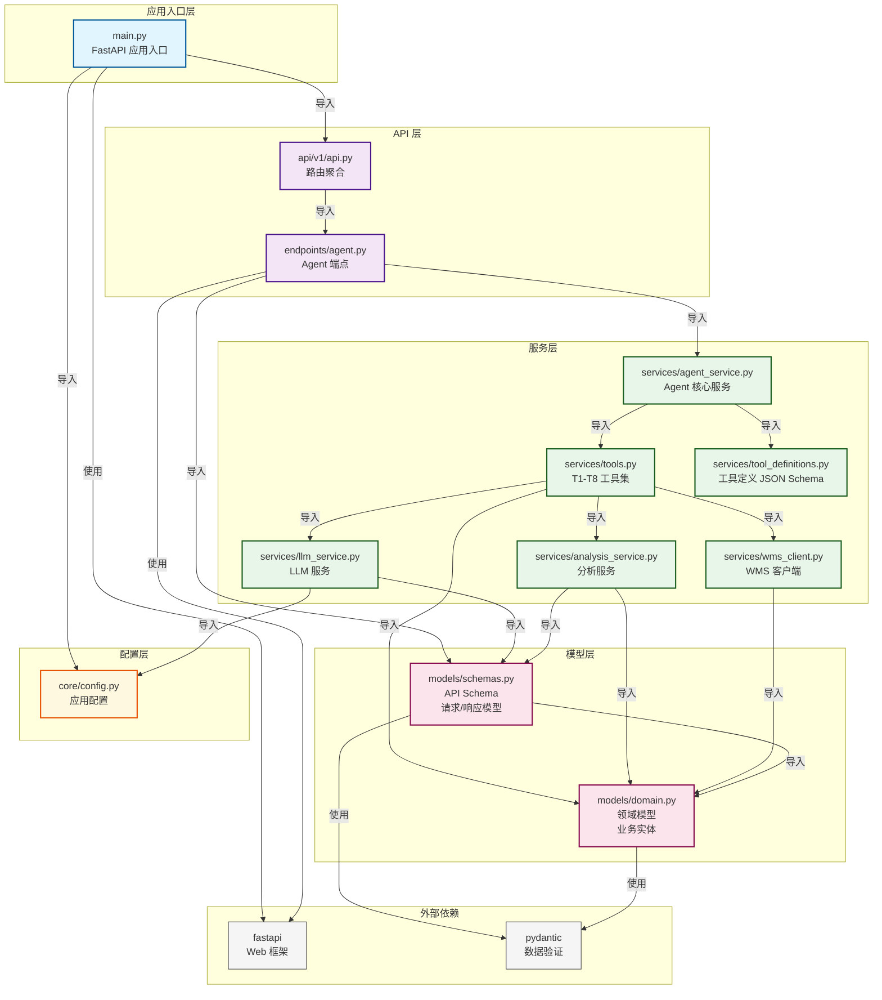

# V006 代码引用关系图

## 完整引用关系图



---

## 分层架构说明

### 1. 应用入口层
- **main.py**: FastAPI 应用入口，配置中间件、注册路由

### 2. API 层
- **api/v1/api.py**: 路由聚合，统一管理所有端点
- **endpoints/agent.py**: Agent 对话端点，接收 HTTP 请求

### 3. 服务层
- **agent_service.py**: Agent 核心编排逻辑，协调 LLM 和工具
- **tools.py**: T1-T8 工具实现，业务逻辑封装
- **llm_service.py**: LLM 调用封装，Function Calling 实现
- **analysis_service.py**: 粮情分析算法
- **wms_client.py**: WMS 数据接口客户端
- **tool_definitions.py**: 工具 JSON Schema 定义（无代码依赖）

### 4. 模型层
- **schemas.py**: API 请求/响应模型（FastAPI 使用）
- **domain.py**: 领域模型（业务实体）

### 5. 配置层
- **config.py**: 应用配置（环境变量、设置）

---

## 关键引用关系详解

### 请求流程引用链

```
HTTP 请求
  ↓
main.py (FastAPI app)
  ↓
api/v1/api.py (路由聚合)
  ↓
endpoints/agent.py (端点处理)
  ↓
agent_service.py (Agent 编排)
  ↓
tools.py (工具执行)
  ├─→ wms_client.py (获取数据)
  ├─→ analysis_service.py (分析计算)
  └─→ llm_service.py (LLM 推理)
```

### 数据模型引用链

```
schemas.py (API Schema)
  ↓ 继承/引用
domain.py (领域模型)
  ↓ 被使用
wms_client.py (返回数据)
analysis_service.py (处理数据)
tools.py (工具返回)
```

### 配置引用链

```
main.py
  ↓
config.py (读取环境变量)
  ↓
llm_service.py (使用 API Key)
```

---

## 依赖方向

**单向依赖原则**：
- 上层依赖下层
- 下层不依赖上层
- 同层可以相互引用

**依赖方向**：
```
应用入口层 → API 层 → 服务层 → 模型层
                ↓
            配置层
```

---

## 模块职责

| 模块 | 职责 | 被引用次数 |
|:---|:---|:---|
| `domain.py` | 领域模型定义 | 4 (schemas, wms_client, analysis_service, tools) |
| `schemas.py` | API Schema 定义 | 3 (agent, llm_service, analysis_service) |
| `tools.py` | 工具集实现 | 1 (agent_service) |
| `wms_client.py` | WMS 数据接口 | 1 (tools) |
| `llm_service.py` | LLM 服务 | 2 (tools, agent_service) |
| `analysis_service.py` | 分析服务 | 1 (tools) |
| `config.py` | 配置管理 | 2 (main, llm_service) |
| `agent_service.py` | Agent 编排 | 1 (agent endpoint) |

---

## 关键设计模式

1. **分层架构**: 清晰的层次划分，职责明确
2. **依赖注入**: 服务通过构造函数注入依赖
3. **单一职责**: 每个模块只负责一个功能领域
4. **接口隔离**: Schema 和 Domain 分离，API 层和业务层分离

